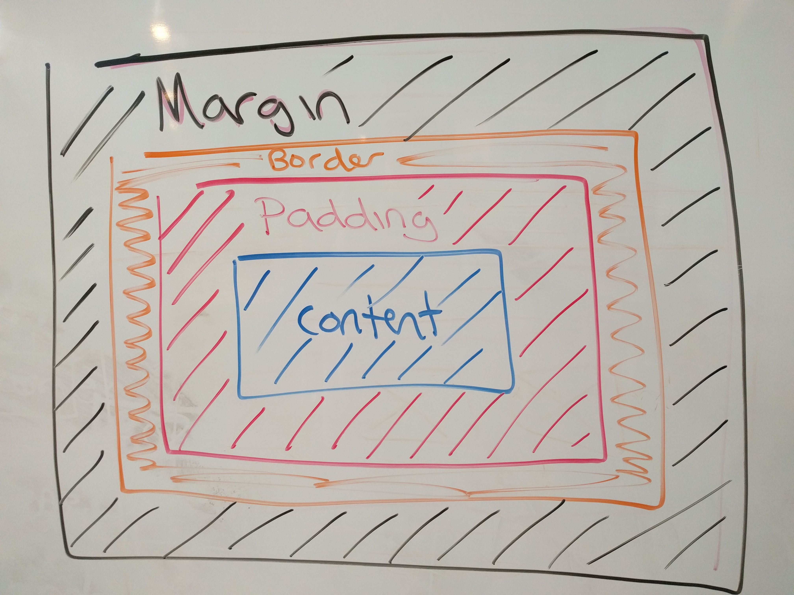

[Table of Contents](/README.md)

# Day 02

## Review
- form elements	- see review html file in examples folder
- move a file from bash
	- `mv <path to file you want to move> <path where you want the file to go>`
- caching of css
	- file system files in the browser won't cache so no worries about refreshing

## Challenge
Get in pairs and work together to build an HTML tree for the AirBnB website. Be prepared to justify why you structured your HTML as you did.

## Notes
- git introduction
	- version control software
	- make a new directory for every project you start
	- turn that directory into a git repository: `git init` from within the project directory
		- this creates a .git folder within your project, where your git history is stored
		- git history is made of commits, which are snapshots of the state of a project at a given moment in time
	- check the status of our repository with `git status` command
	- add files to the stage to prepare for committing : `git add .` this will add any SAVED changes to the stage
	- actually commit : `git commit -m 'commit message goes here'`
	- set up remote repository
		- got to github and make a new project
		- give it a name and nothing else
		- copy the `…or push an existing repository from the command line` commands into your terminal
		- magic happens you're linked to the cloud
		- next time you commit, make sure to follow up with `git push origin master` to update the cloud version of your repo.
- paths
	- relative
		- starts immediately with a file or folder name
		- paths are relative to the current directory
		- `index.html`
		- `./index.html`
		- `../day-02/examples/main.css`
	- root relative
		- starts with a `/`
		- is relative to the root
			- root of the computer (when in the file system)
			- root of the domain (when on the internet)
		- `/home`
		- `/users/nicerhugs`
	- absolute
		- start with the protocol
		- `https://google.com`
		- `file:///Users/TIY/fall-2016/day-02/examples/review.html`
- block vs inline elements
	- block level elements are like containers for things, also referred to as container elements
	- proud parents
		- have children
		- proud - swell to the width of their container!
		- don't like to get close to their neighbors, won't inherently sit next to anything else
		- respectful - will listen to your requests for height or width changes
		- as tall as their contents unless otherwise specified.
		- examples: div, header, footer, main, section, p, form, ul, li
	- inline elements are for text based content, and behave as if they are a line of text
		- bratty teenagers
			- love being next to their friends, treat all white space (including tab or new line) as a single space character
			- don't respect you or your request that they be a particular height or width or top and bottom margin
		- examples: span, a, img, input, button
	- box model
		
		- everything in HTML is a box made up of:
			- content: defined by height and width. the inner most content area of a box
			- padding: the space between the content and it's border.
			- border
			- margin: the space between a border and it's neighbors. margins on the top and bottom sometimes collapse with neighboring margins, called 'collapsing margins'.
		- height and width refer to the content area of a box, unless you change the `box-sizing` property, which you probably want to do.
			- `box-sizing: border-box;` will make the boxes behave more like you expect.
	- layout, aka moving block elements next to each other:
		- `display: inline-block`
			- sort of like the best of both worlds. inline elements become respectful, and block elements go next to each other
			- elements will shrink down to the size of their contents, unless explicit width or height is applied
			- the only problem is that the elements still have white space between them! literal spaces coming from the tabs or new line characters in our HTML
		- `float: left` (or right)
			- moves elements out of the flow of the page. they move UP and to the (left or right) as much as they can, filling whatever space is available.
			- elements will shrink down to the width of their contents, unless explicit height or width is applied.
			- parents of floated elements do not know where their children are, which creates unexpected consequences for styling
				- fix this with the clearfix hack, applied to the parent:
				```css
				.parentElementSelector {
					content: '';
					display: block;
					clear: both;
				}
				```
- css centering
	- centering text content within a block element 	
		- apply to parent element
		```css
		.centering-example {
			text-align: center;
		}
		```
	- centering block level elements themselves
		- apply to element itself, an explicit width and margins:
		```css
		.centered {
			width: 50%; /*you can choose the width to be anything, just you have to set it*/
			margin: 0 auto;
		}
		```

## Resources
[MDN Form resources](https://developer.mozilla.org/en-US/docs/Web/Guide/HTML/Forms)
